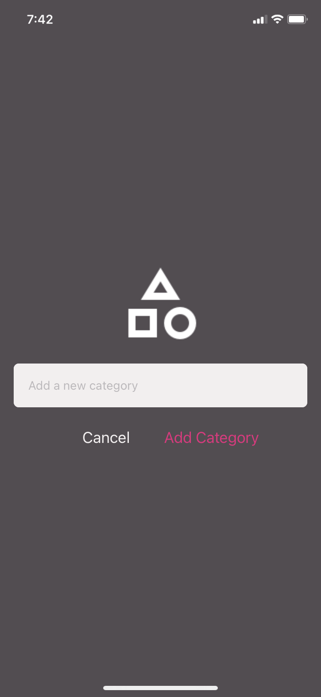
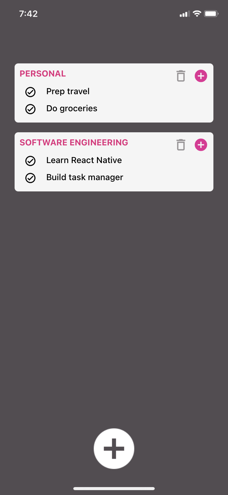
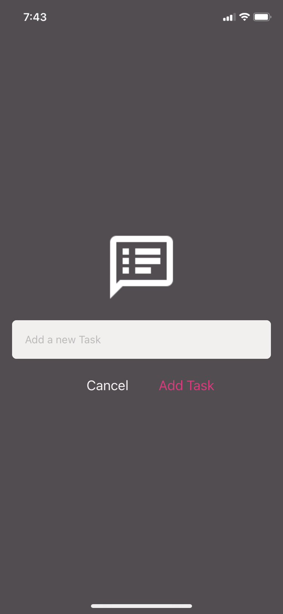

# DoneZone

DoneZone is a user-friendly task management application built using React Native. It simplifies the organization of tasks by allowing users to categorize them into different categories, each with its own dedicated to-do list.

## Features

- Create and manage multiple categories to group related tasks (e.g., work, personal, shopping).
- Mark tasks as completed and track progress.
- Intuitive and straightforward interface for seamless task management.

## Tech Stack

**Client:** React-Native, Expo-Client, JavaScript

## Installation

To get started with DoneZone, follow these steps:

```bash
npm install -g expo-cli
git clone https://github.com/your-username/donezone.git
cd project-folder
npm install
npx expo start
```

## Usage/Examples

    1. Create a new category by clicking on the white "+" button.
    2. Enter category and click "Add Cartegory".
    3. To add a task, tap on the pink "+" button in the top right corner of the category container.
    4. Enter the task and add it by tapping "Add Task"
    5. Mark tasks as completed by tapping on the checkbox. The task will automatically disappear.
    6. To delete an entire category, click on the grey delete icon in the top right corner of the category container.

## Screenshots

<p align="center">
  
  
  
</p>

## Color Reference

| Color                 | Hex                                                              |
| --------------------- | ---------------------------------------------------------------- |
| Background Color      |  #534D52 |
| Text Input Background |  #F3EFEF |
| Highlight Color       |  #E6287D |

## Authors

- [@Isi-Te](https://github.com/Isi-Te)
